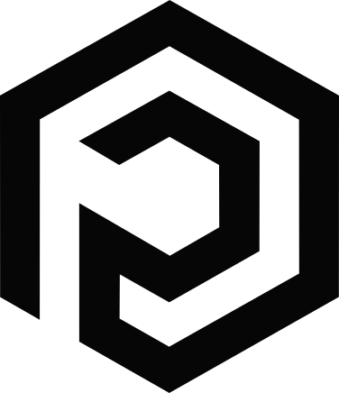
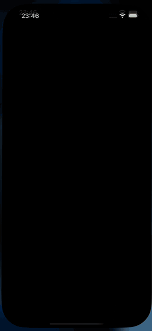

<p align="center">
  <picture>
    <source media="(prefers-color-scheme: dark)" srcset="Resources/pixzl-logo-light.svg">
    
  </picture>
</p>

<h1 align="center">PixzlSwiftLens</h1>

<p align="center">
  <strong>Drop-in SwiftUI debug HUD for iOS.</strong><br>
  One modifier — and you get FPS, RAM, CPU, network calls and live OSLog inside your app.<br>
  Shake to expand. Zero overhead in release.
</p>

<p align="center">
  <a href="https://github.com/your-org/PixzlSwiftLens/actions"></a>
  
  
  
</p>

<p align="center">
  
</p>

```swift
import PixzlSwiftLens

@main
struct MyApp: App {
  var body: some Scene {
    WindowGroup { ContentView() }
      .pixzlSwiftLens()                  // one line. that's it.
  }
}
```

## Why

Live performance + network + logs without leaving the simulator. No Charles. No Instruments. No Console.app. Just shake the device.

- **Pure SwiftUI.** Zero dependencies. Zero hacks for the host app.
- **Swift 6 strict concurrency.** Every actor and `@Sendable` boundary is honest.
- **Compiles to nothing in Release.** `.pixzlSwiftLens()` becomes `self` outside `#if DEBUG` — no symbols, no overhead.

## Install

Swift Package Manager:

```swift
.package(url: "https://github.com/your-org/PixzlSwiftLens.git", from: "0.1.0")
```

Then add `"PixzlSwiftLens"` to your target's dependencies.

## Quickstart

### 1. Attach the HUD

```swift
ContentView()
  .pixzlSwiftLens()                                // shake to toggle
```

### 2. Capture network calls

For custom sessions, build them with the helper:

```swift
let session = URLSession(configuration: .pixzlSwiftLens())
```

For `URLSession.shared` and other ambient traffic, install once at launch:

```swift
@main
struct MyApp: App {
  init() { PixzlSwiftLensNetwork.install() }
  var body: some Scene {
    WindowGroup { ContentView().pixzlSwiftLens() }
  }
}
```

### 3. See your `Logger` output

Nothing to wire — `OSLogStore` is read for the current process, every second. Both `Logger(...)` and `os_log(...)` show up.

## Configuration

| Parameter   | Default          | Options                                                         |
|-------------|------------------|-----------------------------------------------------------------|
| `activator` | `.shake`         | `.shake`, `.threeFingerTap`, `.floatingButton`                  |
| `panels`    | `.all`           | OptionSet of `.performance`, `.network`, `.logs`                |
| `position`  | `.topTrailing`   | `.topLeading`, `.topTrailing`, `.bottomLeading`, `.bottomTrailing` |
| `pillStyle` | `.compact`       | `.compact`, `.detailed`, `.hidden`                              |

```swift
.pixzlSwiftLens(
  activator: .floatingButton,
  panels: [.performance, .network],
  position: .bottomLeading,
  pillStyle: .detailed
)
```

## What you get

**Performance panel** — live FPS / RAM / CPU with rolling 60s charts.
**Network panel** — every URLSession call, inline status, `Copy as cURL`, JSON pretty-print.
**Logs panel** — `OSLogStore` stream with level filter and full-text search.

## Release builds

The public modifier expands to `self` outside `#if DEBUG`. There is no PixzlSwiftLens symbol in your release binary — verify with `nm`:

```sh
xcrun nm -gU YourApp.app/YourApp | grep -i pixzl
# (no output)
```

## Requirements

- iOS 17+
- Swift 6.0+
- Xcode 16+

## License

MIT.
